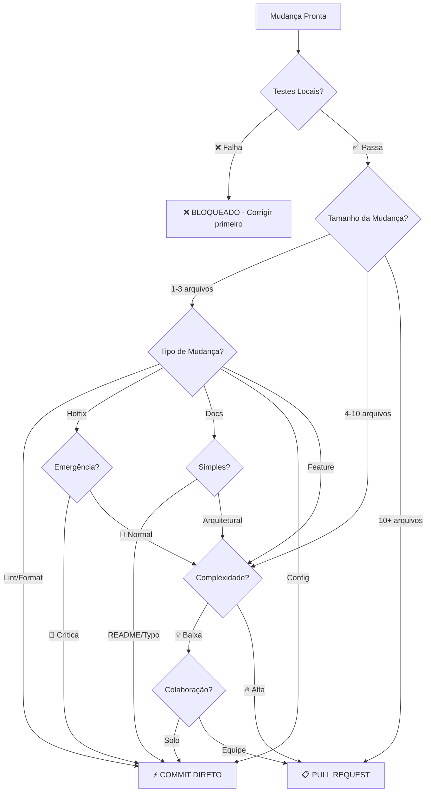

# 🧠 PROTOCOLO INTELIGENTE GIT 2025
## 🌟 Árvore de Decisão: PR vs Commit Direto

*Baseado nas melhores práticas modernas de desenvolvimento de software*

---

## 🤖 **ÁRVORE DE DECISÃO AUTOMATIZADA**

### **🔍 ETAPA 1: ANÁLISE AUTOMÁTICA**



---

## 📊 **MATRIZ DE DECISÃO DETALHADA**

### **⚡ COMMIT DIRETO (Fast Track)**

| Critério | Condição | Peso |
|----------|----------|------|
| **✅ Testes Locais** | Todos passando | Obrigatório |
| **📦 Tamanho** | 1-3 arquivos | Alto |
| **🔧 Tipo** | Lint, hotfix, config | Alto |
| **⏱️ Urgência** | Crítica (produção down) | Alto |
| **👤 Escopo** | Individual | Médio |
| **🧠 Complexidade** | Baixa | Médio |

### **📋 PULL REQUEST (Review Track)**

| Critério | Condição | Peso |
|----------|----------|------|
| **📁 Arquivos** | 4+ arquivos | Alto |
| **🔄 Tipo** | Feature, refactor, migration | Alto |
| **🏗️ Arquitetura** | Mudanças estruturais | Alto |
| **👥 Colaboração** | Múltiplos devs | Alto |
| **🧠 Complexidade** | Média/Alta | Médio |
| **🎯 Aprendizado** | Compartilhar conhecimento | Médio |

---

## 🚀 **TIPOS DE MUDANÇA E PROTOCOLO**

### **⚡ COMMIT DIRETO**

#### **🔧 Manutenção & Correções**
```bash
# ✅ Permitido
git commit -m "fix: corrige typo no README"
git commit -m "style: aplica prettier em Header.tsx"
git commit -m "chore: atualiza versão do package.json"
git commit -m "hotfix: corrige crash crítico de login"
```

#### **📋 Checklist Obrigatório:**
- [x] **Testes locais**: `npm test` passou
- [x] **Lint**: `npm run lint` limpo
- [x] **Build**: `npm run build` sucesso
- [x] **Localhost**: Testado em desenvolvimento (se UX)
- [x] **Escopo**: Mudança isolada e focada
- [x] **Documentação**: Atualizada se necessário

### **📋 PULL REQUEST**

#### **🏗️ Features & Arquitetura**
```bash
# 🔄 Requer PR
git checkout -b feature/dark-mode-toggle
git checkout -b refactor/payment-system
git checkout -b migration/python-backend
git checkout -b performance/lazy-loading
```

#### **📋 Checklist Obrigatório:**
- [x] **Branch separada** criada
- [x] **Testes passando** localmente
- [x] **PR template** preenchido
- [x] **Super Linter** aguardado
- [x] **Reviewers** atribuídos
- [x] **Merge confirmation** solicitada

---

## 🎯 **REGRAS ESPECÍFICAS POR CONTEXTO**

### **🚨 EMERGÊNCIAS**
```bash
# Produção down - COMMIT DIRETO permitido
if [ "$SEVERITY" = "CRITICAL" ] && [ "$TESTS" = "PASSING" ]; then
    git commit -m "hotfix: resolve critical production issue"
    git push origin main
    # Notify team immediately
fi
```

### **🎨 MUDANÇAS UX/UI**
```bash
# SEMPRE testar primeiro (protocolo existente)
npm run dev  # Testar em localhost:8080
# Validar com Roberto
# Só então fazer commit/PR
```

### **🐍 MIGRAÇÕES GRANDES**
```bash
# Python Backend - SEMPRE PR
git checkout -b migration/python-calculations
# Implementar incrementalmente
# PR por módulo migrado
# Manter rollback disponível
```

---

## 📈 **MÉTRICAS DE QUALIDADE**

### **🎯 KPIs do Protocolo**
- **⚡ Fast Track Rate**: % commits diretos vs total
- **🔄 PR Review Time**: Tempo médio de revisão
- **❌ Rollback Rate**: % de reversões necessárias
- **🧪 Test Coverage**: Cobertura mantida >95%
- **🚀 Deploy Frequency**: Frequência de deploys

### **🏆 Metas 2025**
- **Fast Track**: 60-70% das mudanças
- **PR Review**: <24h tempo médio
- **Zero Rollbacks**: Por falhas de teste
- **100% Coverage**: Em funções críticas

---

## 🔄 **PROCESSO ADAPTATIVO**

### **📊 Review Mensal**
1. **Analisar métricas** do protocolo
2. **Ajustar thresholds** conforme aprendizado
3. **Atualizar critérios** baseado em resultados
4. **Treinar equipe** em mudanças

### **🧪 Experimentação**
- **A/B testing** em workflows diferentes
- **Feedback loops** da equipe
- **Benchmarking** com outras equipes
- **Evolução contínua** do protocolo

---

## 🛡️ **SAFEGUARDS E VALIDAÇÕES**

### **🔒 Proteções Automáticas**
```yaml
# GitHub Branch Protection
main:
  required_status_checks:
    - super-linter
    - tests-passing
    - build-success
  restrictions:
    - hotfix_override: true
    - admin_override: true
```

### **🚨 Alertas Automáticos**
- **Slack notification** para commits diretos grandes
- **Email alert** para falhas de teste em main
- **Dashboard metrics** em tempo real
- **Weekly reports** de qualidade

---

## 📝 **TEMPLATE DE DECISÃO RÁPIDA**

### **⚡ Quick Decision Checklist**

```markdown
## 🤔 DEVO FAZER PR OU COMMIT DIRETO?

### ✅ Responda SIM/NÃO:
- [ ] Testes locais passando? (Obrigatório = SIM)
- [ ] Mudança afeta 4+ arquivos? (SIM = PR)
- [ ] É nova feature/refactor? (SIM = PR)  
- [ ] Requer discussão de arquitetura? (SIM = PR)
- [ ] É hotfix crítico? (SIM = Commit Direto)
- [ ] É apenas lint/formatação? (SIM = Commit Direto)

### 🎯 Resultado:
- **2+ SIM para PR** → Criar Pull Request
- **Hotfix/Lint SIM** → Commit Direto
- **Dúvida** → Optar por PR (mais seguro)
```

---

## 🎉 **BENEFÍCIOS ESPERADOS**

### **⚡ Para Desenvolvedor**
- **Clareza** na decisão
- **Menos burocracia** para mudanças simples
- **Foco** em qualidade de código
- **Autonomia** com responsabilidade

### **👥 Para Equipe**
- **Consistência** no workflow
- **Qualidade** mantida
- **Colaboração** otimizada
- **Conhecimento** compartilhado

### **🏢 Para Projeto**
- **Velocidade** aumentada
- **Qualidade** preservada
- **Manutenibilidade** melhorada
- **Escalabilidade** do processo

---

*🤖 Este protocolo evolui com o aprendizado da equipe e métricas de qualidade*

**Versão**: 1.0  
**Data**: Janeiro 2025  
**Próxima revisão**: Fevereiro 2025 