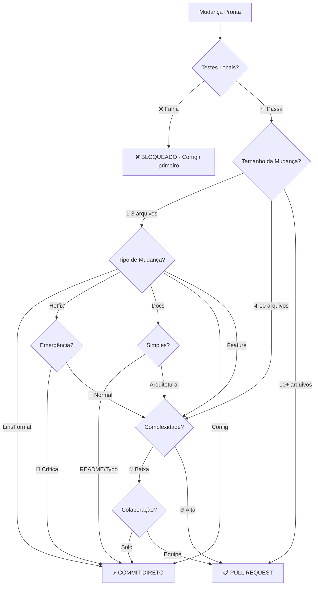

# Agent instructions

### Search for instructions once
At the start of a session, check if any `AGENTS.md` files exist by running:

```bash
find . -name AGENTS.md -print
```

If no path is returned, do **not** repeat the search in the same session. Proceed with the default behavior for the repository.

## Code quality
Run `npm run lint` after modifying code to ensure consistent style. If tests are added later, run `npm test` as well.

## In planning mode, always  read all files in /Users/mac/Documents/futuro-em-foco-planner/docs/ at first


### MCP
# Inventário de MCPs Instalados (Ambiente Cursor)

## Resumo dos MCPs Ativos

| Nome MCP    | Função Principal                                                        | Comando/Localização                                 | Status     |
|-------------|-------------------------------------------------------------------------|-----------------------------------------------------|------------|
| github      | Integração e automação com GitHub (PRs, issues, workflows, CI/CD, etc.) | ghcr.io/github/github-mcp-server (Docker)           | Instalado  |
| mcp-proxy   | Proxy/orquestrador de comandos entre agentes e sistemas (roteamento MCP) | mcpproxy (Python, executado via python3.13)         | Instalado  |
| supabase    | Automação e operações avançadas no Supabase (migrations, edge functions, dados) | @supabase/mcp-server-supabase (npx, Node.js) | Instalado  |


## Detalhes Técnicos dos MCPs

### 1. github
- **Função:** Agente MCP para integração total com GitHub. Permite automação de Pull Requests, issues, revisões, status de CI/CD, e execução de workflows. Usado para orquestrar operações de repositório, automação de qualidade, e integração contínua.
- **Comando:** Executado via Docker com a imagem ghcr.io/github/github-mcp-server.
- **Autenticação:** Requer GitHub Personal Access Token.

### 2. mcp-proxy
- **Função:** Proxy/orquestrador central de comandos MCP. Faz roteamento entre diferentes agentes, permitindo integração entre sistemas heterogêneos (ex: frontend, backend, automações externas).
- **Comando:** Executado via Python 3.13, módulo mcpproxy.
- **Configuração:** Usa arquivo MCPPROXY_CONFIG_PATH para definir rotas e integrações.

#### MCPs configurados no mcp-proxy (mcp_proxy.json):

| MCP               | Função Principal                                                        | Exemplos de Ferramentas Típicas*                |
|-------------------|-------------------------------------------------------------------------|-------------------------------------------------|
| context7          | Análise de contexto, embeddings, busca semântica                        | semantic_search, embedding_generate, etc.       |
| browser-tools     | Diagnóstico e manipulação de navegador                                  | getConsoleLogs, getNetworkErrors, takeScreenshot|
| selenium          | Automação web (Selenium)                                                | click_element, double_click, input_text, hover  |
| playwright        | Automação web avançada (Playwright)                                     | goto, screenshot, fill, evaluate, etc.          |
| sequential-thinking| Execução de fluxos lógicos, raciocínio encadeado                       | run_sequence, chain_tools, etc.                 |
| firecrawl         | Crawling, scraping, geração de llms.txt                                 | generate_llmstxt, crawl_site, extract_content   |
| filesystem        | Manipulação de arquivos e diretórios                                    | read_file, write_file, list_dir, delete_file    |
| postgres          | Operações em banco PostgreSQL                                           | execute_sql, list_tables, run_migration         |
| docker            | Gerenciamento de containers Docker                                      | list_containers, start_container, exec_in_container |

*As ferramentas disponíveis dependem do pool ativo no momento. Para listar as ferramentas realmente disponíveis, use o comando retrieve_tools.

### 3. supabase
- **Função:** Agente MCP para automação e operações avançadas no Supabase. Gerencia migrations, deploy de edge functions, execução de SQL, manipulação de dados, autenticação, e storage.
- **Comando:** Executado via npx com o pacote @supabase/mcp-server-supabase.
- **Autenticação:** Requer Supabase Access Token.
- **Modo:** Executado em modo read-only (parâmetro --read-only).


## Espaço para Novos MCPs

Adicione abaixo novos MCPs conforme forem instalados:

| Nome MCP        | Função Principal | Comando/Localização | Status |
|-----------------|------------------|---------------------|--------|
|                 |                  |                     |        |

#### Procolo_Inteligente_GIT
# 🧠 PROTOCOLO INTELIGENTE GIT 2025
## 🌟 Árvore de Decisão: PR vs Commit Direto

*Baseado nas melhores práticas modernas de desenvolvimento de software*

---

## 🤖 **ÁRVORE DE DECISÃO AUTOMATIZADA**

### **🔍 ETAPA 1: ANÁLISE AUTOMÁTICA**



---

## 📊 **MATRIZ DE DECISÃO DETALHADA**

### **⚡ COMMIT DIRETO (Fast Track)**

| Critério | Condição | Peso |
|----------|----------|------|
| **✅ Testes Locais** | Todos passando | Obrigatório |
| **📦 Tamanho** | 1-3 arquivos | Alto |
| **🔧 Tipo** | Lint, hotfix, config | Alto |
| **⏱️ Urgência** | Crítica (produção down) | Alto |
| **👤 Escopo** | Individual | Médio |
| **🧠 Complexidade** | Baixa | Médio |

### **📋 PULL REQUEST (Review Track)**

| Critério | Condição | Peso |
|----------|----------|------|
| **📁 Arquivos** | 4+ arquivos | Alto |
| **🔄 Tipo** | Feature, refactor, migration | Alto |
| **🏗️ Arquitetura** | Mudanças estruturais | Alto |
| **👥 Colaboração** | Múltiplos devs | Alto |
| **🧠 Complexidade** | Média/Alta | Médio |
| **🎯 Aprendizado** | Compartilhar conhecimento | Médio |

---

## 🚀 **TIPOS DE MUDANÇA E PROTOCOLO**

### **⚡ COMMIT DIRETO**

#### **🔧 Manutenção & Correções**
```bash
# ✅ Permitido
git commit -m "fix: corrige typo no README"
git commit -m "style: aplica prettier em Header.tsx"
git commit -m "chore: atualiza versão do package.json"
git commit -m "hotfix: corrige crash crítico de login"
```

#### **📋 Checklist Obrigatório:**
- [x] **Testes locais**: `npm test` passou
- [x] **Lint**: `npm run lint` limpo
- [x] **Build**: `npm run build` sucesso
- [x] **Localhost**: Testado em desenvolvimento (se UX)
- [x] **Escopo**: Mudança isolada e focada
- [x] **Documentação**: Atualizada se necessário

### **📋 PULL REQUEST**

#### **🏗️ Features & Arquitetura**
```bash
# 🔄 Requer PR
git checkout -b feature/dark-mode-toggle
git checkout -b refactor/payment-system
git checkout -b migration/python-backend
git checkout -b performance/lazy-loading
```

#### **📋 Checklist Obrigatório:**
- [x] **Branch separada** criada
- [x] **Testes passando** localmente
- [x] **PR template** preenchido
- [x] **Super Linter** aguardado
- [x] **Reviewers** atribuídos
- [x] **Merge confirmation** solicitada

---

## 🎯 **REGRAS ESPECÍFICAS POR CONTEXTO**

### **🚨 EMERGÊNCIAS**
```bash
# Produção down - COMMIT DIRETO permitido
if [ "$SEVERITY" = "CRITICAL" ] && [ "$TESTS" = "PASSING" ]; then
    git commit -m "hotfix: resolve critical production issue"
    git push origin main
    # Notify team immediately
fi
```

### **🎨 MUDANÇAS UX/UI**
```bash
# SEMPRE testar primeiro (protocolo existente)
npm run dev  # Testar em localhost:8080
# Validar com Roberto
# Só então fazer commit/PR
```

### **🐍 MIGRAÇÕES GRANDES**
```bash
# Python Backend - SEMPRE PR
git checkout -b migration/python-calculations
# Implementar incrementalmente
# PR por módulo migrado
# Manter rollback disponível
```

---

## 📈 **MÉTRICAS DE QUALIDADE**

### **🎯 KPIs do Protocolo**
- **⚡ Fast Track Rate**: % commits diretos vs total
- **🔄 PR Review Time**: Tempo médio de revisão
- **❌ Rollback Rate**: % de reversões necessárias
- **🧪 Test Coverage**: Cobertura mantida >95%
- **🚀 Deploy Frequency**: Frequência de deploys

### **🏆 Metas 2025**
- **Fast Track**: 60-70% das mudanças
- **PR Review**: <24h tempo médio
- **Zero Rollbacks**: Por falhas de teste
- **100% Coverage**: Em funções críticas

---

## 🔄 **PROCESSO ADAPTATIVO**

### **📊 Review Mensal**
1. **Analisar métricas** do protocolo
2. **Ajustar thresholds** conforme aprendizado
3. **Atualizar critérios** baseado em resultados
4. **Treinar equipe** em mudanças

### **🧪 Experimentação**
- **A/B testing** em workflows diferentes
- **Feedback loops** da equipe
- **Benchmarking** com outras equipes
- **Evolução contínua** do protocolo

---

## 🛡️ **SAFEGUARDS E VALIDAÇÕES**

### **🔒 Proteções Automáticas**
```yaml
# GitHub Branch Protection
main:
  required_status_checks:
    - super-linter
    - tests-passing
    - build-success
  restrictions:
    - hotfix_override: true
    - admin_override: true
```

### **🚨 Alertas Automáticos**
- **Slack notification** para commits diretos grandes
- **Email alert** para falhas de teste em main
- **Dashboard metrics** em tempo real
- **Weekly reports** de qualidade

---

## 📝 **TEMPLATE DE DECISÃO RÁPIDA**

### **⚡ Quick Decision Checklist**

```markdown
## 🤔 DEVO FAZER PR OU COMMIT DIRETO?

### ✅ Responda SIM/NÃO:
- [ ] Testes locais passando? (Obrigatório = SIM)
- [ ] Mudança afeta 4+ arquivos? (SIM = PR)
- [ ] É nova feature/refactor? (SIM = PR)  
- [ ] Requer discussão de arquitetura? (SIM = PR)
- [ ] É hotfix crítico? (SIM = Commit Direto)
- [ ] É apenas lint/formatação? (SIM = Commit Direto)

### 🎯 Resultado:
- **2+ SIM para PR** → Criar Pull Request
- **Hotfix/Lint SIM** → Commit Direto
- **Dúvida** → Optar por PR (mais seguro)
```

---

## 🎉 **BENEFÍCIOS ESPERADOS**

### **⚡ Para Desenvolvedor**
- **Clareza** na decisão
- **Menos burocracia** para mudanças simples
- **Foco** em qualidade de código
- **Autonomia** com responsabilidade

### **👥 Para Equipe**
- **Consistência** no workflow
- **Qualidade** mantida
- **Colaboração** otimizada
- **Conhecimento** compartilhado

### **🏢 Para Projeto**
- **Velocidade** aumentada
- **Qualidade** preservada
- **Manutenibilidade** melhorada
- **Escalabilidade** do processo

---

*🤖 Este protocolo evolui com o aprendizado da equipe e métricas de qualidade*

**Versão**: 1.0  
**Data**: Janeiro 2025  
**Próxima revisão**: Fevereiro 2025 


# 🏆 SUPER LINTER BEST PRACTICES - Stack Específico

## 🎯 **NOSSO STACK TECNOLÓGICO (2025)**

### **Frontend Core:**
- **React 18.3.1** + **TypeScript 5.8.3**
- **Vite 5.4.19** (build tool moderno)
- **Tailwind CSS 3.4.11** (utility-first CSS)
- **Radix UI** (headless components)
- **Recharts** (data visualization)

### **Backend & Services:**
- **Supabase** (backend-as-a-service)
- **PostHog** (product analytics)

### **Development Tools:**
- **ESLint 9.29.0** + **Prettier 3.5.3**
- **Husky 9.1.7** (git hooks)
- **lint-staged 16.1.2** (staged files linting)

## 🚀 **CONFIGURAÇÃO OTIMIZADA SUPER LINTER**

### **1. Approach: SELECTIVE EXCLUSION**
```yaml
# ✅ RECOMENDADO: Usar apenas exclusões (VALIDATE_*=false)
# ❌ EVITAR: Misturar inclusões e exclusões
env:
  VALIDATE_ALL_CODEBASE: false
  DEFAULT_BRANCH: "main"
  
  # Disable problematic/redundant linters
  VALIDATE_TYPESCRIPT_STANDARD: false  # Conflita com ESLint v9
  VALIDATE_TYPESCRIPT_ES: false        # Redundante com nosso ESLint
  VALIDATE_TSX: false                   # Redundante com nosso ESLint
  VALIDATE_PRETTIER: false             # Já integrado no ESLint
  VALIDATE_YAML: false                  # Muitos false positives
  VALIDATE_JSON: false                  # Muitos false positives
  
  # Keep essential linters (default enabled)
  # VALIDATE_JSCPD: true (default)
  # VALIDATE_GITLEAKS: true (default)
  # VALIDATE_CHECKOV: true (default)
```

### **2. Configuração JSCPD Otimizada**
```json
{
  "threshold": 5,
  "minLines": 10,
  "minTokens": 50,
  "ignore": [
    "src/lib/gbm/**",           // Algoritmos matemáticos complexos
    "src/integrations/**",      // Código de integração padronizado
    "src/components/ui/**",     // Componentes Radix/shadcn
    "src/styles/**",            // CSS utilitário
    "**/*.test.ts",             // Testes podem ter padrões similares
    "**/node_modules/**",       // Dependências
    "**/dist/**",               // Build artifacts
    "**/*.md"                   // Documentação
  ],
  "reporters": ["console"],
  "format": ["typescript", "javascript", "tsx", "jsx"]
}
```

### **3. Exclusões de Arquivos Inteligentes**
```yaml
FILTER_REGEX_EXCLUDE: "tsconfig\\..*\\.json|package-lock\\.json|bun\\.lockb|\\.vscode/|\\.git/|node_modules/|dist/|build/|coverage/|.*\\.md$"
```

## 🎯 **MELHORES PRÁTICAS POR CATEGORIA**

### **A. TypeScript & React**
- ✅ **Usar ESLint local** em vez do Super Linter para TS/TSX
- ✅ **Configurar tsconfig.json** com strict mode
- ✅ **Usar Prettier integrado** no ESLint
- ❌ **Evitar** VALIDATE_TYPESCRIPT_* no Super Linter

### **B. Segurança**
- ✅ **Manter GITLEAKS** habilitado (default)
- ✅ **Manter CHECKOV** habilitado (default)
- ✅ **Configurar .gitleaksignore** se necessário
- ✅ **Revisar regularmente** dependências vulneráveis

### **C. Qualidade de Código**
- ✅ **JSCPD configurado** com threshold realista (5%)
- ✅ **Exclusões inteligentes** para código gerado/padrão
- ✅ **Monitoramento contínuo** de duplicação
- ✅ **Refatoração proativa** quando threshold excedido

### **D. Performance**
- ✅ **VALIDATE_ALL_CODEBASE: false** para PRs
- ✅ **Exclusões específicas** para arquivos grandes
- ✅ **Cache de dependências** quando possível
- ✅ **Paralelização** de linters independentes

## 🔧 **CONFIGURAÇÃO RECOMENDADA FINAL**

```yaml
name: Lint Code Base
on:
  push:
    branches: [ "main" ]
  pull_request:
    branches: [ "main" ]

jobs:
  run-lint:
    runs-on: ubuntu-latest
    steps:
      - name: Checkout code
        uses: actions/checkout@v4
        with:
          fetch-depth: 0

      - name: Lint Code Base
        uses: github/super-linter@v6
        env:
          VALIDATE_ALL_CODEBASE: false
          DEFAULT_BRANCH: "main"
          
          # Disable redundant/problematic linters
          VALIDATE_TYPESCRIPT_STANDARD: false
          VALIDATE_TYPESCRIPT_ES: false
          VALIDATE_TSX: false
          VALIDATE_PRETTIER: false
          VALIDATE_YAML: false
          VALIDATE_JSON: false
          VALIDATE_HTML: false
          VALIDATE_CSS: false
          
          # Configure JSCPD
          JSCPD_CONFIG_FILE: ".jscpd.json"
          
          # Smart exclusions
          FILTER_REGEX_EXCLUDE: "tsconfig\\..*\\.json|package-lock\\.json|bun\\.lockb|\\.vscode/|\\.git/|node_modules/|dist/|build/|.*\\.md$"
          
          GITHUB_TOKEN: ${{ secrets.GITHUB_TOKEN }}
```

## 📊 **MÉTRICAS DE QUALIDADE**

### **Target Goals:**
- 🎯 **JSCPD**: < 5% duplicação
- 🎯 **GITLEAKS**: 0 secrets expostos
- 🎯 **CHECKOV**: 0 vulnerabilidades críticas
- 🎯 **Build Time**: < 2 minutos
- 🎯 **False Positives**: < 5%

### **Monitoramento:**
- ✅ **Weekly Review** dos resultados
- ✅ **Threshold Adjustment** baseado em métricas
- ✅ **Exclusion Tuning** para reduzir ruído
- ✅ **Performance Tracking** do pipeline

## 🚨 **TROUBLESHOOTING COMUM**

### **Erro: "Behavior not supported"**
- **Causa**: Mistura de VALIDATE=true e VALIDATE=false
- **Solução**: Usar apenas exclusões (VALIDATE=false)

### **JSCPD False Positives**
- **Causa**: Threshold muito baixo ou padrões normais
- **Solução**: Ajustar threshold e adicionar exclusões

### **Performance Issues**
- **Causa**: VALIDATE_ALL_CODEBASE=true em repos grandes
- **Solução**: Usar VALIDATE_ALL_CODEBASE=false

### **TypeScript Conflicts**
- **Causa**: Super Linter ESLint vs Local ESLint
- **Solução**: Desabilitar VALIDATE_TYPESCRIPT_* no Super Linter

## 🎉 **RESULTADO ESPERADO**

Com essa configuração otimizada:
- ✅ **Zero conflitos** de configuração
- ✅ **Tempo de execução** reduzido
- ✅ **False positives** minimizados  
- ✅ **Qualidade de código** mantida
- ✅ **Developer Experience** melhorada 

---

## 📚 **HISTÓRICO E CONTEXTO (O PORQUÊ DAS DECISÕES)**

- **Incompatibilidade ESLint v9**: O Super Linter encontrou problemas ao tentar usar sua versão interna do ESLint em nosso código configurado para a v9 (moderna). A solução foi desativar a validação de `TypeScript/TSX` no Super Linter, confiando em nossa pipeline local, que é mais precisa.
- **Duplicação de Código (JSCPD)**: O linter inicialmente detectou duplicação em algoritmos de simulação. Isso foi resolvido através da refatoração do código para um módulo `simulationUtils.ts` compartilhado, eliminando a redundância e melhorando a manutenibilidade.
- **Pre-commit Hooks**: A automação com `husky` e `lint-staged` foi implementada para remover o fardo de rodar linters manualmente e garantir que todo código enviado ao repositório já esteja formatado e sem erros básicos.

---

## 🛠️ **COMANDOS ESSENCIAIS (WORKFLOW LOCAL)**

Os seguintes scripts no `package.json` são a base do nosso workflow de qualidade diário:

- **`npm run lint`**: Executa o ESLint em todo o projeto para verificar erros.
- **`npm run lint:fix`**: Tenta corrigir automaticamente os problemas encontrados pelo ESLint.
- **`npm run format`**: Formata todo o código do projeto usando as regras do Prettier.
- **`npm run marco-zero`**: Comando completo que verifica tipos (`tsc`), executa o lint e faz o build, garantindo que o projeto está 100% saudável. 


